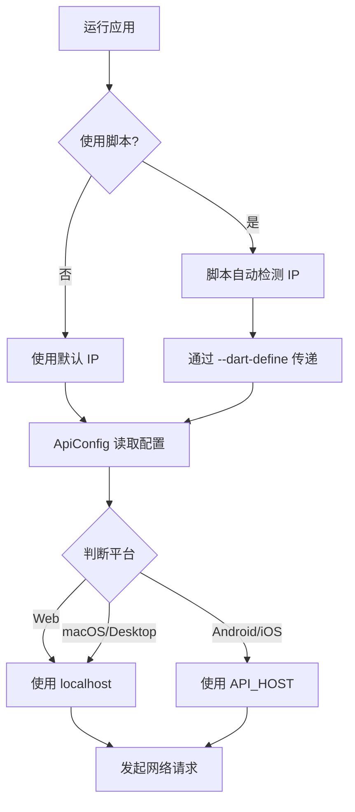

# API 配置自动获取方案

## 🎯 解决方案概述

为了解决不同设备需要不同 IP 地址的问题，我们实现了**运行时自动配置**方案：

### 核心特性

1. ✅ **智能平台检测**：自动根据运行平台选择合适的 API 地址
2. ✅ **环境变量支持**：通过 `--dart-define` 在运行时传递配置
3. ✅ **自动获取脚本**：一键检测 IP 并启动应用
4. ✅ **默认值回退**：如果没有传递参数，使用代码中的默认值

---

## 📁 相关文件

```
example/
├── lib/
│   └── core/
│       └── constant/
│           ├── index.dart          # API 配置类（核心）
│           └── README.md           # 详细配置说明
├── run_with_auto_ip.sh             # macOS/Linux 自动脚本
└── run_with_auto_ip.bat            # Windows 自动脚本
```

---

## 🚀 使用方法

### 方法 1：自动脚本（推荐）⭐

**macOS/Linux:**

```bash
cd example
./run_with_auto_ip.sh
```

**Windows:**

```cmd
cd example
run_with_auto_ip.bat
```

**指定设备:**

```bash
./run_with_auto_ip.sh emulator-5554
```

### 方法 2：手动命令行

```bash
flutter run \
  --dart-define=API_HOST=192.168.8.75 \
  --dart-define=API_PORT=3000
```

### 方法 3：修改默认值

编辑 `lib/core/constant/index.dart`:

```dart
static const String _localNetworkIP = String.fromEnvironment(
  'API_HOST',
  defaultValue: '192.168.8.75', // 修改这里
);
```

---

## 🔧 技术实现

### 1. 配置类设计

```dart
class ApiConfig {
  // 从环境变量读取，支持运行时覆盖
  static const String _localNetworkIP = String.fromEnvironment(
    'API_HOST',
    defaultValue: '192.168.8.75',
  );

  static const int _port = int.fromEnvironment(
    'API_PORT',
    defaultValue: 3000,
  );

  // 根据平台自动选择
  static String get baseUrl {
    if (kIsWeb) {
      return 'http://localhost:$_port$_apiPrefix';
    }

    if (defaultTargetPlatform == TargetPlatform.android ||
        defaultTargetPlatform == TargetPlatform.iOS) {
      return 'http://$_localNetworkIP:$_port$_apiPrefix';
    }

    return 'http://localhost:$_port$_apiPrefix';
  }
}
```

### 2. 自动脚本原理

```bash
# 1. 获取局域网 IP
LOCAL_IP=$(ifconfig | grep "inet " | grep -v 127.0.0.1 | awk '{print $2}' | head -n 1)

# 2. 传递给 Flutter
flutter run --dart-define=API_HOST=$LOCAL_IP
```

### 3. 配置优先级

```
命令行参数 (--dart-define) > 代码默认值 (defaultValue)
```

---

## 💡 工作流程



---

## 📊 平台适配表

| 平台           | API 地址                    | 说明              |
| -------------- | --------------------------- | ----------------- |
| Web (Chrome)   | `http://localhost:3000/api` | 浏览器同源策略    |
| Android 真机   | `http://{IP}:3000/api`      | 需要局域网 IP     |
| Android 模拟器 | `http://{IP}:3000/api`      | 需要局域网 IP     |
| iOS 真机       | `http://{IP}:3000/api`      | 需要局域网 IP     |
| iOS 模拟器     | `http://localhost:3000/api` | 与 Mac 共享网络栈 |
| macOS          | `http://localhost:3000/api` | 本地运行          |
| Windows        | `http://localhost:3000/api` | 本地运行          |
| Linux          | `http://localhost:3000/api` | 本地运行          |

---

## 🔍 调试技巧

### 查看当前配置

应用启动时会自动打印：

```
🔧 API Configuration:
   Platform: android
   Base URL: http://192.168.8.75:3000/api
   Local IP: 192.168.8.75
   Port: 3000
```

### 手动检查 IP

```bash
# macOS
ipconfig getifaddr en0

# 或查看所有网络接口
ifconfig | grep "inet " | grep -v 127.0.0.1
```

### 验证服务器可达性

```bash
curl http://192.168.8.75:3000/health
```

---

## ⚠️ 常见问题

### Q1: IP 地址变化了怎么办？

**A:** 使用自动脚本 `./run_with_auto_ip.sh`，每次都会重新检测 IP。

### Q2: 如何在团队中共享配置？

**A:**

1. 将脚本加入版本控制
2. 每个人运行脚本时自动获取自己的 IP
3. 不需要修改代码

### Q3: 生产环境怎么办？

**A:**

1. 修改 `defaultValue` 为生产服务器域名
2. 或在 CI/CD 中使用 `--dart-define` 传入生产地址

### Q4: 为什么不用 DNS 或服务发现？

**A:**

- 开发环境追求简单快速
- 生产环境应该使用域名
- 此方案平衡了灵活性和复杂度

---

## 🎓 最佳实践

1. **日常开发**：始终使用 `./run_with_auto_ip.sh`
2. **切换网络**：重新运行脚本即可
3. **团队协作**：每个人都使用脚本，无需沟通 IP
4. **CI/CD**：在构建命令中使用 `--dart-define`
5. **生产发布**：修改默认值为正式服务器地址

---

## 📚 相关文档

- [详细配置说明](./lib/core/constant/README.md)
- [Flutter Environment Variables](https://docs.flutter.dev/deployment/environment-config)
- [Dart fromEnvironment](https://api.dart.dev/stable/dart-core/String/fromEnvironment.html)
